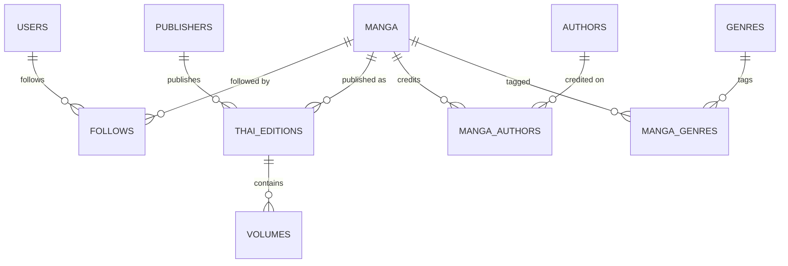

# Postgres schema

Status: implemented. See [`postgres-migration.md`](postgres-migration.md)
for the earlier Mongo→Postgres cutover, and the relational redesign this
doc now describes replaced that first Postgres schema outright — see
"Why the redesign" below for what changed and why.

## Why the redesign

The first Postgres schema (a fairly direct port of the old Mongo shape)
had `manga` doing three jobs at once: the work itself, its Thai
publication details (`publisher`, `first_date_th`), and a single
`author`/`genre` string that couldn't represent more than one credited
person or category. It also stored derived values —
`subscribers_count`, `score`, `total_voters`, `last_vol` — kept in sync by
application code and a trigger, which is exactly the kind of
denormalization that drifts out of sync the moment one code path forgets
to update it.

The product direction is narrower than that schema assumed: no reviews,
ratings, comments, or ownership/collection tracking, and no retailer or
scraping data. What's left is a clean read path — browse/search manga,
view a manga's official Thai edition and its volumes, follow a manga — so
the schema was redesigned around that, with authors and genres promoted
to real many-to-many relations instead of strings, and every derived
value replaced by a query computed on demand.

## Schema



### `users`

| Column         | Type          | Notes                          |
|----------------|---------------|---------------------------------|
| `id`           | uuid PK       | `gen_random_uuid()`             |
| `line_user_id` | text UNIQUE   | the LINE `sub` claim             |
| `display_name` | text          | from LINE profile, editable      |
| `picture_url`  | text          | from LINE profile, editable      |
| `created_at`   | timestamptz   |                                  |
| `updated_at`   | timestamptz   | set by the app on every update   |

### `manga`

The work itself — no publisher, author, genre, or Thai-specific fields
here, those live in the tables below.

| Column           | Type        | Notes |
|------------------|-------------|-------|
| `id`             | uuid PK     | |
| `title_original` | text        | e.g. the Japanese title |
| `title_en`       | text        | |
| `introduction`   | text        | |
| `image_url`      | text        | |
| `first_date_jp`  | date        | original JP release |
| `status`         | text        | free text (e.g. ongoing/completed) — not an enum, left open since the domain doesn't fix the set of values |
| `created_at`     | timestamptz | |
| `updated_at`     | timestamptz | |

Indexed on `title_original` and `title_en` for the `GET /manga?q=` search.

### `publishers`

| Column        | Type        |
|---------------|-------------|
| `id`          | uuid PK     |
| `name`        | text UNIQUE |
| `website_url` | text        |
| `logo_url`    | text        |
| `created_at`  | timestamptz |
| `updated_at`  | timestamptz |

### `thai_editions`

The official Thai release of a manga — a manga can have more than one
(e.g. a re-release under a different publisher), which is why this is its
own table with a `manga_id` FK rather than columns on `manga`.

| Column          | Type        | Notes |
|-----------------|-------------|-------|
| `id`            | uuid PK     | |
| `manga_id`      | uuid FK     | → `manga.id`, cascades on delete |
| `publisher_id`  | uuid FK     | → `publishers.id`, `ON DELETE RESTRICT` — a publisher can't be deleted out from under an edition that references it |
| `title_th`      | text        | |
| `first_date_th` | date        | |
| `created_at`    | timestamptz | |
| `updated_at`    | timestamptz | |

`UNIQUE (manga_id, publisher_id)` — one edition per publisher per manga.

### `volumes`

A Thai edition's volumes, with release dates. Renamed from the old
`vols`; scoped by `thai_edition_id` rather than `manga_id` since a volume
belongs to a specific edition, not the work in the abstract.

| Column            | Type          | Notes |
|-------------------|---------------|-------|
| `id`              | uuid PK       | |
| `thai_edition_id` | uuid FK       | → `thai_editions.id`, cascades on delete |
| `volume_number`   | int           | |
| `isbn`            | text UNIQUE   | nullable |
| `publish_date`    | date          | |
| `price`           | numeric(10,2) | nullable |
| `image_url`       | text          | |
| `status`          | text          | free text, same reasoning as `manga.status` |
| `created_at`      | timestamptz   | |
| `updated_at`      | timestamptz   | |

`UNIQUE (thai_edition_id, volume_number)`.

### `follows`

Renamed from `subscriptions` to match the "follow" language used
everywhere else. A pure join table — no `total_owner_count`-style counter
maintained anywhere; follower counts, if ever needed, are a `COUNT(*)`
against this table rather than a stored column.

| Column       | Type        |
|--------------|-------------|
| `user_id`    | uuid FK     |
| `manga_id`   | uuid FK     |
| `created_at` | timestamptz |

`PRIMARY KEY (user_id, manga_id)`.

### `authors` / `manga_authors`

`authors` is just `id`/`name`/timestamps. `manga_authors` is the
many-to-many join, with a `role` column so one person can be credited
differently across works (or multiple times on the same work — story vs.
art):

```sql
role text NOT NULL CHECK (role IN ('author', 'artist', 'story', 'illustrator'))
```

`PRIMARY KEY (manga_id, author_id, role)`.

### `genres` / `manga_genres`

`genres` is `id`/`name` only — no timestamps, it's pure reference data.
`manga_genres` is the join table, `PRIMARY KEY (manga_id, genre_id)`.

## Indexes

Beyond the primary keys and the two `UNIQUE` constraints above:
`idx_manga_title_original`, `idx_manga_title_en` (search),
`idx_thai_editions_manga_id`, `idx_thai_editions_publisher_id`,
`idx_volumes_thai_edition_id`, `idx_follows_manga_id`,
`idx_manga_authors_author_id`, `idx_manga_genres_genre_id` — one per FK
that gets queried in the reverse direction from its owning table.

## What stays as-is

- Admin auth is still `ADMIN_USERNAME`/`ADMIN_PASSWORD_HASH` env vars +
  bcrypt, not a database table — out of scope for this redesign.
- `GET /manga/trending|new|recommend` still pick randomly from
  `GetMangas("")` via `service.RandomManga` — placeholder ranking logic,
  unrelated to the schema change.
- RLS is enabled with no policies on every table (including all the new
  ones), same reasoning as before: the Go backend connects as the
  `postgres` role (`BYPASSRLS`), so this only blocks Supabase's PostgREST
  auto-exposure of the `public` schema, not the app itself.

## Migration approach

Same as before: one init script
(`docker/postgres/init/001_schema.sql`), not an incremental migration
chain. This redesign **replaced that file in place** rather than adding a
`002_...sql` — there was no data worth preserving (Postman test rows
only), so the change was applied by dropping and recreating rather than
writing a migration script for data that didn't need migrating. If real
user data exists the next time the schema changes, that assumption no
longer holds and an incremental migration is the right call.

## Deliberately not done

- **Reviews, ratings, comments, ownership/collection tracking,
  retailer/purchase links, scraping tables** — explicitly out of scope
  for the current product direction, not just deferred.
- **Notifications for new volume releases** — the `follows` +
  `thai_editions`/`volumes` relationship already supports this (join
  user → follows → manga → thai_editions → volumes, notify on insert)
  without any additional schema; no `notifications` table exists yet
  because the feature itself hasn't been built.
- **Frontend updates** — `manga-tracker-cli` and `manga-tracker-backoffice`
  both consume the old flat `manga`/`vols` shape directly and will not
  work against this API until updated separately; that's tracked as
  follow-up work, not part of this change.
