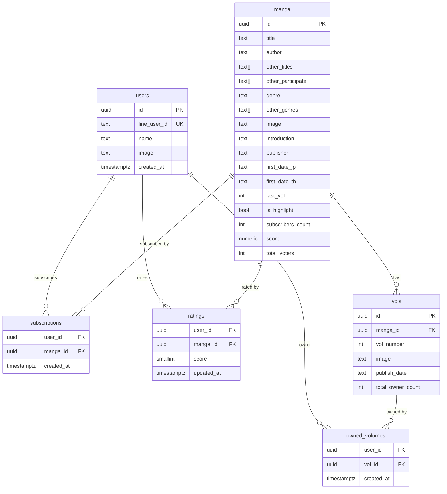

# PostgreSQL schema design

**Status: implemented.** `db/`, `models/`, and `repo/` were rewritten
against this schema — see
[`postgres-migration.md`](postgres-migration.md) for exactly what changed
in that cutover. This document is kept as the schema reference and the
reasoning behind each table; it was written by reading every Mongo
`models/*.go` and `repo/*.go` file before the rewrite, so it covers what
the app did before, mapped onto a relational shape.

## Why move off Mongo

The current data isn't document-shaped, it's relational — users subscribe
to manga, own specific volumes, and rate manga; those are all many-to-many
relationships currently faked with string lists (`SubscribeList`) and maps
(`OwnerList`, `RateList`) embedded in the `User` document. That has two
concrete costs today, not just a style preference:

1. **No referential integrity.** `SubscribeList` and `OwnerList` store
   manga/vol IDs as bare strings. Nothing stops a dangling reference to a
   deleted manga; `repo/manga.go`'s `isMangaExist` is a hand-rolled
   check standing in for what a foreign key gives you for free.
2. **Read-modify-write races.** `SubscribeMangaById`, `UpdateOwnerList`,
   `UpdateMangaSubscriber`, and `UpdateMangaScore` all fetch a document,
   mutate it in Go, then `$set` the whole field back. Two concurrent
   requests from the same user (e.g. a double-tap) can lose an update.
   `UpdateMangaScore`'s running-average math (`(Score+score)/TotalVoters`)
   is also just wrong — it doesn't factor out the previous average
   correctly. Postgres transactions plus a trigger-maintained aggregate
   (below) fix both problems structurally instead of patching the Go.

## Schema

### `users`

| column        | type          | notes                                             |
|---------------|---------------|----------------------------------------------------|
| id            | uuid PK       | `gen_random_uuid()` default (pgcrypto)             |
| line_user_id  | text UNIQUE   | raw LINE `sub`, stored directly                    |
| name          | text          |                                                      |
| image         | text          |                                                      |
| created_at    | timestamptz   | default `now()`                                    |

This drops `service/user_service.go`'s `EncryptHexId`/`shieftHex`/`meanHex`
entirely. That code exists only to turn a LINE `sub` into something that
looks like a Mongo ObjectID; with a real DB the user table just has its own
generated `id` and a unique, indexed `line_user_id` column to look users up
by. No custom encoding, no collision risk.

### `manga`

| column              | type         | notes                                          |
|---------------------|--------------|--------------------------------------------------|
| id                  | uuid PK      |                                                    |
| title               | text         | indexed, used by `GetMangaByTitle`               |
| author              | text         |                                                    |
| other_titles        | text[]       | was `OtherTitle []string`                        |
| other_participate   | text[]       |                                                    |
| genre               | text         |                                                    |
| other_genres        | text[]       |                                                    |
| image               | text         |                                                    |
| introduction        | text         |                                                    |
| publisher           | text         |                                                    |
| first_date_jp       | text         | kept as text — source data isn't reliably parseable to `date` |
| first_date_th       | text         |                                                    |
| last_vol            | int          | default 0                                        |
| is_highlight        | bool         | replaces the hardcoded ObjectID in `GetMangaHighlight` |
| subscribers_count   | int          | denormalized, see below                          |
| score               | numeric(3,2) | denormalized, see below                          |
| total_voters        | int          | denormalized, see below                          |

`other_titles`/`other_participate`/`other_genres` stay as Postgres native
arrays rather than join tables — they're descriptive, not something the
app currently filters or joins on. If genre filtering becomes a real
feature later, that's the point to normalize `genre`/`other_genres` into a
`genres` + `manga_genres` join table; not needed for parity today.

`subscribers_count`, `score`, `total_voters` stay as denormalized columns
(so the manga list page doesn't need a join/aggregate on every request),
but they're no longer mutated by read-modify-write Go code. Instead:

- `subscriptions`/`ratings` inserts and deletes update the counters in the
  *same transaction*, using `UPDATE manga SET subscribers_count =
  subscribers_count + 1 WHERE id = $1` — atomic, no lost updates.
- `score`/`total_voters` are maintained by a Postgres trigger on
  `ratings` (`AFTER INSERT OR UPDATE OR DELETE`) that recomputes
  `AVG(score)`/`COUNT(*)` for that manga. This replaces
  `UpdateMangaScore`'s incorrect running-average formula with a value
  that's always exactly right, computed by Postgres itself.

### `vols`

| column            | type      | notes                                  |
|-------------------|-----------|------------------------------------------|
| id                | uuid PK   |                                            |
| manga_id          | uuid FK   | `REFERENCES manga(id) ON DELETE CASCADE` |
| vol_number        | int       |                                            |
| image             | text      |                                            |
| publish_date      | text      |                                            |
| total_owner_count | int       | denormalized, atomic-updated like above  |

`UNIQUE (manga_id, vol_number)` replaces the manual "already added this
vol" loop in `repo/vol.go`'s `AddMangaVol`.

### `subscriptions` (replaces `User.SubscribeList`)

| column     | type        |
|------------|-------------|
| user_id    | uuid FK → `users(id) ON DELETE CASCADE` |
| manga_id   | uuid FK → `manga(id) ON DELETE CASCADE` |
| created_at | timestamptz |

`PRIMARY KEY (user_id, manga_id)`. Toggling subscribe = `INSERT ... ON
CONFLICT DO NOTHING` / `DELETE`, each wrapped with the `subscribers_count`
update in one transaction.

### `owned_volumes` (replaces `User.OwnerList`)

| column     | type        |
|------------|-------------|
| user_id    | uuid FK → `users(id) ON DELETE CASCADE` |
| vol_id     | uuid FK → `vols(id) ON DELETE CASCADE`  |
| created_at | timestamptz |

`PRIMARY KEY (user_id, vol_id)`. Referencing `vols.id` (not
`manga_id`+`vol_number`) means you *cannot* record ownership of a volume
that doesn't exist — the foreign key does what `isMangaExist` currently
does by hand, and does it correctly (today's check is keyed on manga, not
the specific volume).

### `ratings` (replaces `User.RateList`)

| column     | type                              | notes |
|------------|-----------------------------------|-------|
| user_id    | uuid FK → `users(id) ON DELETE CASCADE` | |
| manga_id   | uuid FK → `manga(id) ON DELETE CASCADE` | |
| score      | smallint CHECK (score BETWEEN 1 AND 5)  | |
| updated_at | timestamptz | |

`PRIMARY KEY (user_id, manga_id)`. The current API treats a score of `0`
as "remove my rating" — that becomes `DELETE FROM ratings WHERE user_id =
$1 AND manga_id = $2` instead of storing a sentinel `0` value, and the
`CHECK` constraint means invalid scores are rejected by the database, not
just by application code.

## Indexes

- `users(line_user_id)` — unique, needed on every login
- `manga(title)` — `GetMangaByTitle`
- `manga(is_highlight)` — partial index `WHERE is_highlight` if you keep
  more than one flagged row over time
- `vols(manga_id)`
- `subscriptions(manga_id)`, `owned_volumes(vol_id)`, `ratings(manga_id)`

## What stays as-is

- Admin auth stays env-var + bcrypt (already fixed, see
  `security-fixes.md`) — no `admins` table unless you want more than one
  admin account later.
- `GetMangaTrending`/`GetMangaRecommend`/`GetMangaNew` are just random
  sampling today (`service.RandomManga`); `ORDER BY random() LIMIT n` is
  the direct SQL equivalent and is fine at this data size.

## Migration approach

This was the plan going into the rewrite; see
[`postgres-migration.md`](postgres-migration.md) for what actually
happened and where it diverged (schema itself didn't change — the
divergences are all in how the Go code maps onto it).

1. Write the schema above as versioned SQL — done as a single init script
   (`docker/postgres/init/001_schema.sql`) rather than incremental
   migrations, since there was no existing production schema to migrate
   *from*. If/when this needs to evolve after real data exists in it,
   switch to `golang-migrate` or `goose` for versioned migrations instead
   of editing the init script in place.
2. Swap `db/db.go` for a `pgx`/`pgxpool` connection pool, driven by a
   single `DATABASE_URL` env var instead of the old
   `DB_USER`/`DB_PASS` string concatenation — done.
3. Rewrite `models/`, `repo/`, and the handlers that touch `SubscribeList`
   /`OwnerList`/`RateList` — done.
4. One-time data migration script to carry over existing Mongo data —
   **not done**. There was no reachable production Mongo data at the time
   of this migration (see the "no database, do I need one" conversation
   that kicked this off); if that changes, write an export/import script
   before pointing production at the new schema.
